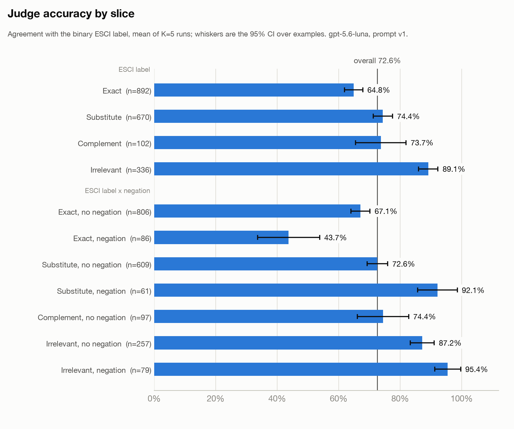

# Judge the Judge

An LLM decides whether a product is relevant to a search query. This repo measures how far you can trust that decision,
using repeated runs, confidence intervals and a blind human review, on Amazon's ESCI shopping-queries benchmark.
Professionally it's a relevance eval harness. The point isn't that an LLM can judge relevance; everyone knows that.
It's whether you can trust the judge.

## The problem

You build an LLM judge that decides whether a product is a relevant result for a search query. You run it once and it
agrees with the dataset's labels 73% of the time. What does that number mean? Four things make a single score like that lie:

1. **The judge is stochastic.** One run is one draw from a distribution, not a measurement. The same eval can read 72% one day and 74% the next.
2. **There is no uncertainty on it.** A bare percentage doesn't say whether a two-point improvement from a new prompt is real or noise.
3. **The aggregate hides slices.** An overall 73% can contain a slice at 44% and one at 95%.
4. **The ground truth is itself imperfect.** If you score the judge against labels that are sometimes wrong, some of the judge's "errors" belong to the labels.

This repo is a small harness built around those four problems: repeated runs, confidence intervals, pass@k and pass^k,
significance tests on deltas, stratified reporting, and a blind human review of the judge itself. It is deliberately small
(one locale, 2,000 pairs, one judge) so that everything in it is finished and checked.

**What I found, briefly.** Scored against ESCI the judge looks like 72.6%. Against a careful human reading the same title it
agrees about 91% of the time, while ESCI itself agrees with that human only 79% of the time. Most of the judge's apparent
errors come from the ground truth, in two quite different ways. I also had a hypothesis about why the judge fails on queries
with exclusions ("lamp *without* shade"), my first test of it was badly designed, and the corrected test mostly went
against it. Details in [Findings](#findings).

## Approach

Each step is one module, and each produces something the next step needs.

| Step | Code | What it does |
|---|---|---|
| Judge | [src/judge.py](src/judge.py) | One binary rubric question ("would a shopper consider this a directly relevant result they might buy?"), returning a verdict, a one-sentence justification, and the title evidence it relied on. Parse failures and infra failures are separate statuses and are never counted as wrong answers. |
| Repeated runs | [src/harness.py](src/harness.py) | Runs the judge K=5 times per example and saves every raw verdict, plus a metadata block pinning model, prompt hash, dataset revision and seed. Resumable. |
| Statistics | [src/stats.py](src/stats.py), [tests/test_stats.py](tests/test_stats.py) | Example-level CI, Student's t CI over runs, pass@k and pass^k, paired delta, Welch's test. 29 unit tests with hand-computed expected values. |
| Stratified report | [src/report.py](src/report.py) | Per-slice accuracy with CIs, the confusion matrix, infra failures stated separately, plots. |
| Interrogating the eval | [src/human_eval.py](src/human_eval.py) | Blind human labeling on a stratified sample, with weighted agreement estimates. |

The eval slice is 2,000 (query, product) pairs from ESCI's US-locale `small_version == 1` test rows, sampled with a fixed
seed and pinned to a specific dataset revision. Ground truth is collapsed to binary: **Exact** is relevant; **Substitute,
Complement and Irrelevant** are not. That's a v1 simplification, and it matters for the findings below. The slice is 44.6%
relevant, so an always-"not relevant" judge would already score 55.4%.

The judge is `gpt-5.6-luna` at its default temperature, with a title-only prompt. Every API call is logged with its cost.

## Results

All numbers are from one run: 2,000 examples × K=5 = 10,000 calls. Reproduce with `make report` (see [Reproduce it](#reproduce-it)).

**Accuracy against the ESCI label (mean ± 95% CI)**

| | |
|---|---|
| Mean pass rate | **72.6%** (always-"not relevant" baseline: 55.4%) |
| 95% CI over examples | [70.7%, 74.4%]: how much accuracy moves with *which examples* were sampled |
| 95% CI over runs (Student's t, K=5) | [72.3%, 72.8%]: how much the *judge itself* wobbles on this fixed set |
| Run-level pass rates | 0.7270, 0.7240, 0.7279, 0.7249, 0.7240 |
| Failures, kept out of every number here | 2 parse failures, 0 infra failures (of 10,000 calls) |

Both intervals are reported because they answer different questions. The run-level interval is narrow: the judge is very
stable. The example-level interval is wider, and is the one that reflects how much the sample of examples matters. Neither
says anything about production traffic: ESCI is curated, not a random sample.

**Capability versus consistency**

| k | pass@k (right at least once in k tries) | pass^k (right on all k tries) |
|---|---|---|
| 1 | 72.6% | 72.6% |
| 2 | 74.7% | 70.4% |
| 3 | 75.7% | 69.2% |
| 4 | 76.3% | 68.3% |
| 5 | 76.7% | 67.7% |

By k=5 about 9 points of examples are right on some runs and wrong on others. That's real inconsistency, though the judge
is mostly consistent. These metrics are cleanest for a deterministic rater; here "success" means agreeing with a possibly-loose
label, so they mix judge noise with label noise.

**By slice.** The aggregate hides a lot. Accuracy is 64.8% on Exact matches and 89.1% on Irrelevant, with intervals that
exclude the overall mean:

| Slice | n | Accuracy | 95% CI over examples |
|---|---|---|---|
| ESCI Exact | 892 | 64.8% | [61.9%, 67.8%] |
| ESCI Substitute | 670 | 74.4% | [71.2%, 77.5%] |
| ESCI Complement | 102 | 73.7% | [65.5%, 81.9%] |
| ESCI Irrelevant | 336 | 89.1% | [85.9%, 92.3%] |
| Exact, query has negation | 86 | 43.7% | [33.6%, 53.8%] |



**Which way it errs.** Over valid calls the judge produced 1,568 false negatives (called an Exact match "not relevant")
against 1,176 false positives: precision 71.1%, recall 64.8%, specificity 78.8%. It is stricter than ESCI, not looser.
465 of the 2,000 examples are wrong on every run, which is where the interesting disagreements live.

**A sanity check on the delta machinery.** Running the same prompt and model twice on 20 shared examples should show no
difference. It gave +2.33 pts, CI [-2.24, +6.91], correctly "not significant". It's a check that the machinery doesn't
invent improvements, not a result about the judge.

## Findings

This is the part the rest of the project is for. The headline 72.6% is the judge scored against ESCI. To find out whether that
number measures the judge or the labels, I labeled 45 items myself, blind: only the query and the product title, in shuffled order,
with no ESCI label and no judge verdict shown, answering the question the judge was asked.

### 1. The judge agrees with a human more than ESCI does

| Comparison | Agreement | 95% CI | Cohen's kappa |
|---|---|---|---|
| Judge vs human (mean over 5 runs) | **90.6%** | [83.8%, 96.6%] | |
| Judge vs human (majority vote of runs) | 93.2% | [87.6%, 98.3%] | 0.86 |
| **ESCI label vs human** | **78.8%** | [68.2%, 87.3%] | **0.58** |

When the judge's majority verdict disagreed with ESCI (15 of 42 labeled items), the human sided with the judge in 11 and
with ESCI in 4.

The sample is stratified on purpose: 15 items wrong on all five runs (out of 465), 12 Exact + negation items that weren't
always-wrong (out of 42), and 18 drawn at random from the remaining 1,493. Oversampling the hard cases would make the judge look
worse than it is, so whole-set numbers weight each item by its stratum's size, with stratified-bootstrap CIs.

**Evidence that the weighting works.** Applying the same estimator to a quantity I can compute exactly, the judge's
accuracy against ESCI over all 2,000 examples, gives **71.7%** [63.4%, 76.8%] from the 45-item sample, against a true value of
**72.6%**. It recovers a number I can check. It is not a proof the human-agreement numbers are unbiased, but it is the
evidence that the estimator isn't broken.

### 2. The ground truth has two different problems

Of the 11 cases where the judge "failed" and the human agreed with the judge, I expected "loose labels". It was two things:

**Loose Substitute labels (3 of 11).** Reasonable closeness that the binary collapse discards.

- *"cosplay mask"* / "YangYong Kitsune Fox Mask for Christmas Costume, Animal Cosplay Kabuki Half Face Cat Masks Masquerade Party": ESCI **Substitute**; judge said relevant in 5/5 runs; human: yes.
- *"key locks for kids"* / "Guaishou Mix Color Style Mini Heart Luggage Locks Padlocks ... Pack of 7pcs": ESCI **Substitute**; judge 5/5; human: yes.
- *"toddler books moo moo cow"* / "Mr. Brown Can Moo, Can You: Dr. Seuss's Book of Wonderful Noises": ESCI **Irrelevant**, which is hard to defend.

**Exact labels on products that don't match the query (8 of 11).** This is not looseness. The label looks wrong.

- *"togas boys"* / "Ravensburger - Gravitrax Kit de Inicio, Juego STEM innovador y educativo ..." (a Spanish-language marble-run kit): ESCI **Exact**; judge relevant 0/5; human: no.
- *"mtm gun case"* / "MTM AC50C-40 50-Caliber Ammo Can, Black": ESCI **Exact**; the judge: "an ammunition storage can rather than a case designed to hold a gun."
- *"vape pods device"* / "IT'S A SKIN Decal Vinyl Wrap for Smok Novo Pod System Vape Sticker": ESCI **Exact**; a sticker for the device, not the device.

I can't tell from this data whether these are annotator errors or an artifact of how the pre-joined HuggingFace copy was
assembled. The Spanish-language listing under a US locale makes me suspicious of the join, but that is a suspicion, not a finding.
The check is to compare them with the official ESCI files, joined on `(product_locale, product_id)`. I haven't done it.

### 3. Where the judge really is wrong

Four of the 15 disagreements: the human sided with ESCI.

- *"danny devito"* / "Ruthless People": needs outside knowledge the title lacks.
- *"24 inch deep pocket king sheets"*: the judge wouldn't confirm a 24-inch fit from a title that doesn't state it.
- *"mercer bread knife millenia"* / "Mercer Millennia Granton Edge Slicer": over-literal; a slicer isn't the words "bread knife".
- *"ri"* / *The Fellowship Of The Ring*: the only false positive; it matched the prefix to "Ring".

Three of four are the judge being stricter than a human on an Exact match, consistent with its 1,568 false negatives. Four cases
is too few to call a pattern.

### 4. The negation hypothesis, and a mistake in my own sampling

The slice table above shows Exact matches with a negation query ("without", "not") at 43.7%. My hypothesis was that the judge
fails because it can't verify an exclusion from a title that doesn't mention one.

**The mistake.** My first human-review sample included a stratum meant to probe this: Exact + negation items. I defined it to
exclude examples that were already wrong on every run, as a way of keeping the strata disjoint. But 44 of those 86 examples *are*
wrong on every run. The stratum I built to test the hypothesis excluded exactly the cases that mattered. It came back 11 of 11
correct, and that was the clue: it could only contain cases the judge already got right. Strata should be defined by what you're
measuring, not filtered by the outcome. I wrote this up as "my sample could not test it" and didn't claim a result.

**The follow-up.** I sampled the failures directly: 15 at random from the 44, labeled blind from the title. The human **confirmed
the judge on 12 of 15 (80%)**, exact 95% CI **[51.9%, 95.7%]**. Before merging the labels I sorted the 15 into four categories
from the query and title alone, and recorded that assignment in the code:

| Category | n | Human confirms judge | Judge wrong |
|---|---|---|---|
| Title contradicts the exclusion (a floor lamp "with Adjustable Drum Shade" for *floor lamp without shade*) | 6 | 5 | 1 |
| Title silent on the exclusion, so unverifiable (the hypothesis) | 5 | 4 | 1 |
| Not a real exclusion, or a different product | 3 | 3 | 0 |
| Title satisfies the exclusion | 1 | 0 | 1 |

- **The hypothesis is only weakly supported.** The judge erred because a title was silent in 2 of 16 reviewed items (this review plus the one earlier item). In 4 of 5 title-silent cases the human also couldn't confirm the exclusion, so "can't verify, so not relevant" is a stance the judge and the human share.
- **Most of the 44 are label problems or non-negations.** Where the title contradicts the exclusion, the judge was right 5 of 6 times. Two "negation" items were a book title ("Waiting Is Not Easy") and a game name ("No U") that merely contained a negation keyword, so my keyword filter overcounts negation.
- **The slice is better than it looks.** Across all 86 Exact + negation examples the judge agrees with the human about 87% (bootstrap 95% CI [74.2%, 96.6%]; this counts a title-silent "human no" as agreement), against 43.7% versus ESCI.

I'm confident of the direction (most of the 44 aren't the judge failing on negation) and not of the magnitude. With 15 items I
can't rule out that up to about half of the 44 are real judge errors, so I don't quote a precise judge-error rate for this slice.

Full write-up, including the cases and the limitations: [results/FINDINGS.md](results/FINDINGS.md).

## What v2 would do

- **Graded relevance.** Score Substitute separately, or as relevant for query types like "cosplay mask", instead of collapsing it with Irrelevant.
- **Audit the Exact labels** against the official ESCI files before trusting any "judge failed on an Exact" number.
- **A prompt that sees bullet points and descriptions**, tested with the paired-delta tool rather than asserted to help. The judge currently sees only the title.
- **A real negation detector** in place of the keyword regex.
- **A retrieval-coverage leg.** v1 separates "judge wrong" from "label wrong", but not from "the right product was never retrieved". That separation matters in a real system and isn't built here.
- **A second annotator**, and more random items, to tighten the whole-set agreement number.
- **Online evaluation** against real traffic rather than a curated benchmark.

## Limitations

This does not show that the judge is good in production. The 91% is agreement with one annotator (me) on 45 items, 17 of them
random, so its interval is wide ([83.8%, 96.6%]); there is no inter-annotator agreement to put a ceiling on it. I labeled from the
title only, the same information the judge saw, which is fair but favours the judge, because ESCI's annotators saw the full listing.
I had read my own negation hypothesis before labeling, and in the follow-up I also knew the items were all ESCI-Exact and judge-negative,
so the blinding there was weaker. The category assignments in the follow-up are one rater's judgment, and the negation filter is a
keyword regex. ESCI is a curated benchmark, several of its pairs share a query, and I only evaluated one model, one prompt and one
locale, so the example-level interval is probably too narrow for production traffic. The hand labels have now been read alongside the
disagreements, so they shouldn't be reused as a clean test set for a v2 prompt.

## Reproduce it

You need Python 3.10+ (with `lzma`). Nothing below needs an API key except `demo` and `reproduce`.

```bash
make install        # create .venv and install requirements
make test           # 29 unit tests for the statistics (no data, no key)
make report         # rebuild the eval slice, then reproduce every number above from the committed results (no key, no cost)
```

`make report` downloads ESCI's four test parquet files (about 715 MB) from the pinned HuggingFace revision, one shard at a time,
filters each, and deletes it, so peak extra disk is about one shard. The frozen slice itself is a 1.6 MB file.

To produce a *new* result with your own key (`cp .env.example .env` and set `OPENAI_API_KEY`):

```bash
make demo           # 200 examples x K=3, about 600 calls, about $0.11, then the report
make reproduce      # the full 2,000 x K=5 run: 10,000 calls, about $1.80, about 45 minutes
```

A run that is interrupted resumes with `python -m src.harness --resume <run_id>`. Every API call is appended to
[costs/api_cost_log.jsonl](costs/api_cost_log.jsonl); `python -m src.costs` totals it. Whole project spend, including a stalled
run that had to be thrown away, was $2.40. `make check-readme` re-runs the code and asserts that the numbers quoted in this README
match what it prints.

```
config/eval_config.yaml   every pinned knob: model, prompt version, dataset revision, seeds, K, pricing
src/                      data, judge, harness, stats, report, human_eval, costs
tests/test_stats.py       hand-computed unit tests for the math
results/                  raw run JSON, reports, plots, FINDINGS.md
labeling/                 the blind labeling tool, the answer keys, and the human labels
```

---

*This is a public reconstruction of evaluation patterns I use in production relevance systems; no employer data or code is used.*
